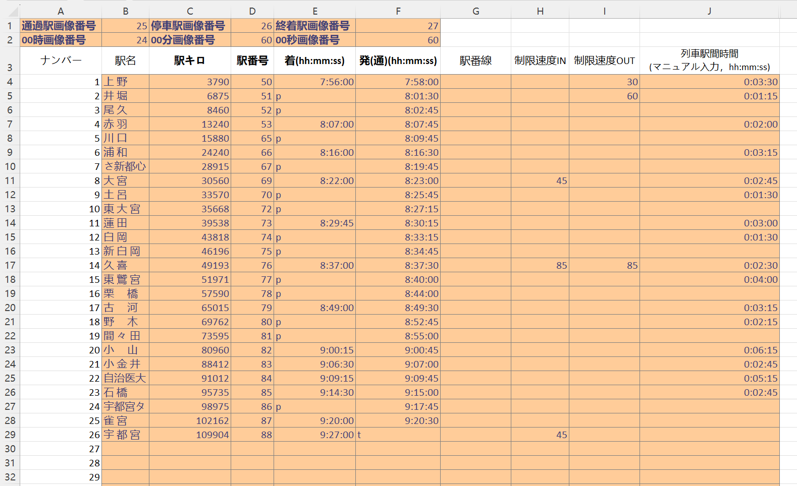
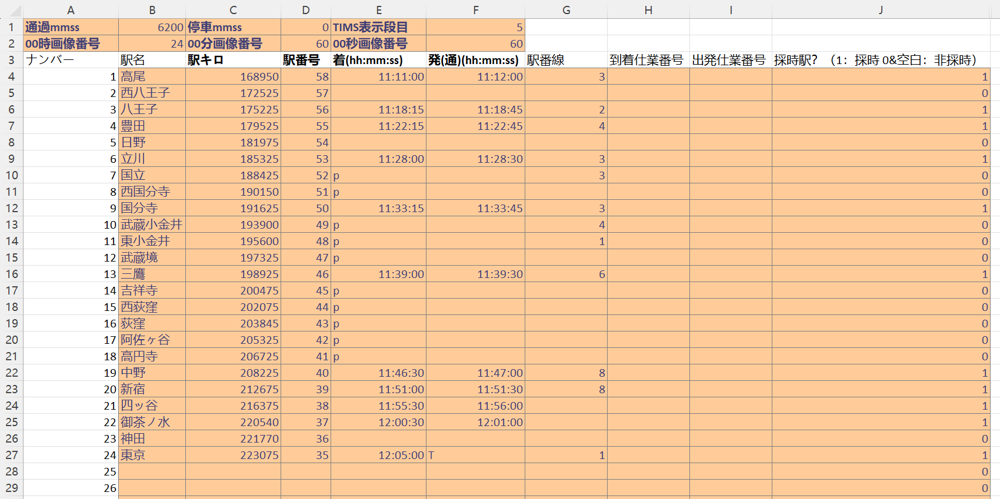
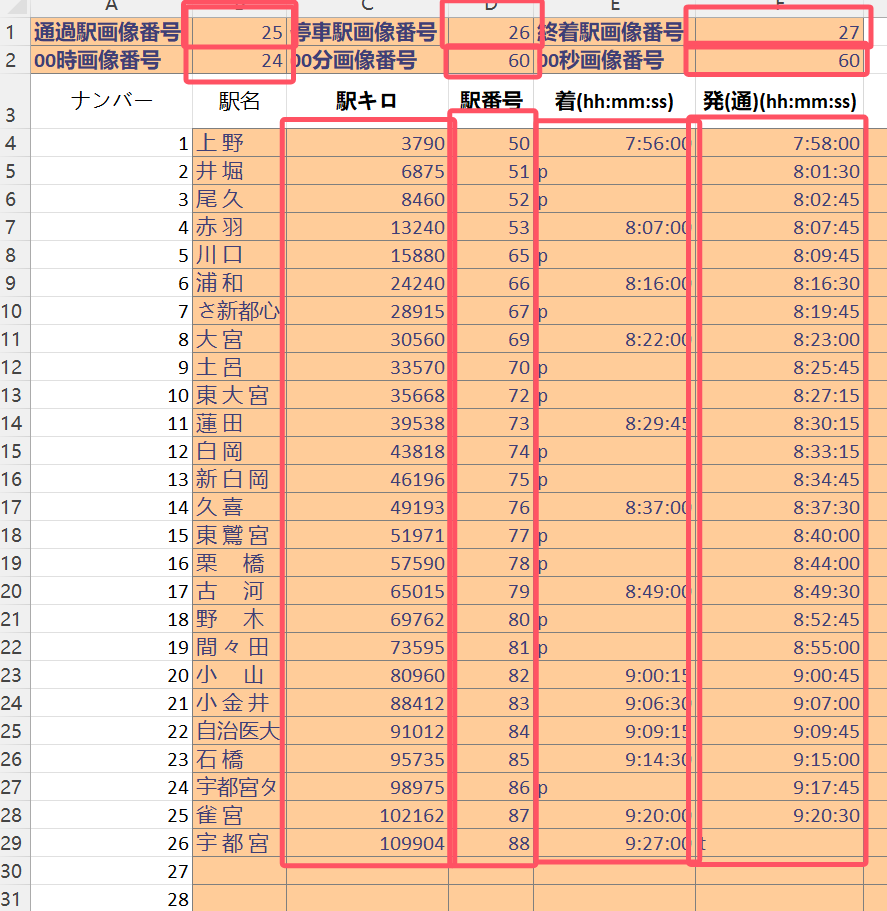
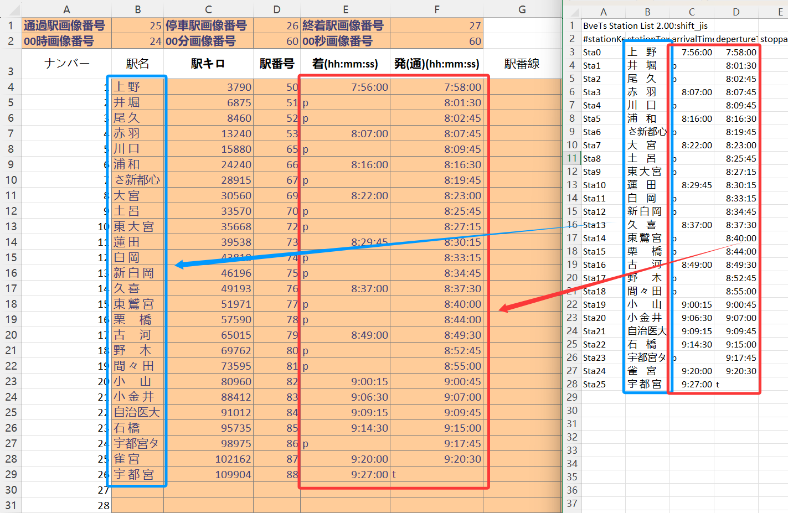
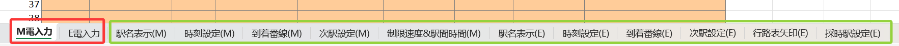
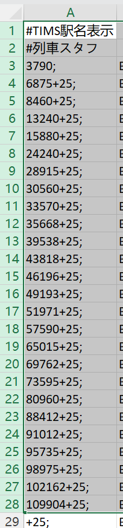
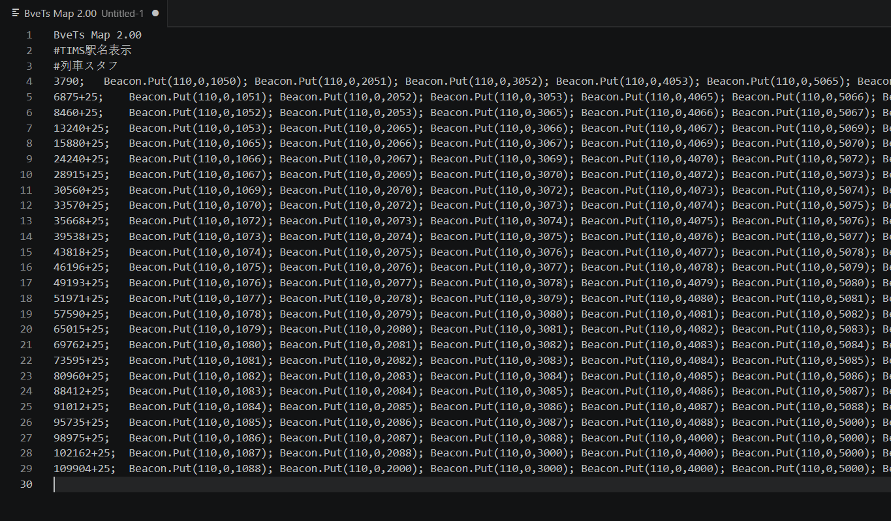
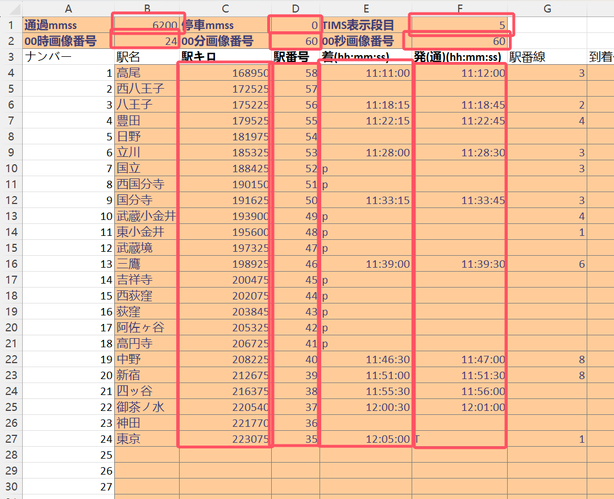

（DeepLで翻訳したため、意味に不正確な点がある可能性があります）
# TIMS構文作成電卓
[ダウンロード](https://github.com/njfdCRH1A/TIMS-Excel/raw/refs/heads/main/TIMS_tool_v2.xlsx"ダウンロード")
## ファイル概要
M電時刻表編集エリア

（時刻表は那須野氏作成のJR宇都宮線3523M快速ラピット）

E電時刻表編集エリア

（時刻表は822sty氏作成のJR中央線1160T特別快速）
## 使い方：
**M電・E電のいずれを使用する場合でも、駅距離、駅のTIMS画像番号、到着時刻、発車（通過時刻）は必須項目です。これらが入力されていないと、結果に誤りが生じます**
### I、M電時刻表（列車時刻表）の編集
#### 1、データの入力

図中の赤枠で囲まれた箇所はすべて必須項目です。上記の必須項目に加え、通過駅（時間欄に「↓」と表示）、停車駅（時間欄に「停」と表示）、終着駅（時間欄に「=」と表示）に対応する画像番号、および0時0分0秒の時刻に対応する画像番号を入力する必要がある点にご注意ください

時刻と駅名はstationlistファイルから直接コピーできます。表は自動的に時刻を抽出し、TIMSの表示形式に変換します。駅名は関連データの計算には影響せず、照合を容易にするためのものです。

さらに、必要に応じて駅の線路、入出站制限速度、区間所要時間を記入することも可能です。区間所要時間を記入しない場合、現在の行の発車時刻と次の行の到着時刻の差が自動的に計算されます。必要であれば、区間所要時間の欄にhh:mm:ssの形式で記入してください
#### 2、結果の生成
以下のブックマークオプションをご覧ください。最初の表はM電時刻表の入力用、2番目の表はE電時刻表の入力用です。2番目の表の後に、表の自動計算によって生成された結果が表示されます。(M)のラベルが付いているものは、M電時刻表の生成結果です。生成された結果を選択し、編集中のTIMS時刻表にコピーしてください。

M駅名表示を例に、まず下図に示す表を選択します


生成結果を選択します



編集中のTIMSファイルに貼り付けるだけで完了です



同様に、駅時刻や線路なども同じ手順で編集中のTIMSファイルに貼り付けます
最終的なTIMSファイルは以下のようになります：
```
BveTs Map 2.00
#TIMS駅名表示                        
#列車スタッフ                        
3790;    Beacon.Put(110,0,1050);    Beacon.Put(110,0,2051);    Beacon.Put(110,0,3052);	Beacon.Put(110,0,4053);    Beacon.Put(110,0,5065);    Beacon.Put(110,0,6066);
6875+25;    Beacon.Put(110,0,1051);    Beacon.Put(110,0,2052);	Beacon.Put(110,0,3053);    Beacon.Put(110,0,4065);    Beacon.Put(110,0,5066);    Beacon.Put(110,0,6067);
8460+25;    Beacon.Put(110,0,1052);	Beacon.Put(110,0,2053);    Beacon.Put(110,0,3065);    Beacon.Put(110,0,4066);    Beacon.Put(110,0,5067);    Beacon.Put(110,0,6069);
13240+25;    Beacon.Put(110,0,1053);    Beacon.Put(110,0,2065);    Beacon.Put(110,0,3066);    Beacon.Put(110,0,4067);	Beacon.Put(110,0,5069);    Beacon.Put(110,0,6070);
15880+25;    Beacon.Put(110,0,1065);    Beacon.Put(110,0,2066);    Beacon.Put(110,0,3067);	Beacon.Put(110,0,4069);    Beacon.Put(110,0,5070);    Beacon.Put(110,0,6072);
24240+25;    Beacon.Put(110,0,1066);    Beacon.Put(110,0,2067);	Beacon.Put(110,0,3069);    Beacon.Put(110,0,4070);    Beacon.Put(110,0,5072);    Beacon.Put(110,0,6073);
（以下略）
#TIMS時刻設定												
#列車スタフ												
3790;	Beacon.Put(111,0,1075660);	Beacon.Put(111,0,2250000);	Beacon.Put(111,0,3250000);	Beacon.Put(111,0,4000760);	Beacon.Put(111,0,5250000);	Beacon.Put(111,0,6001660);	Beacon.Put(112,0,1075860);	Beacon.Put(112,0,2080130);	Beacon.Put(112,0,3000245);	Beacon.Put(112,0,4000745);	Beacon.Put(112,0,5000945);	Beacon.Put(112,0,6001630);
6875+25;	Beacon.Put(111,0,1250000);	Beacon.Put(111,0,2250000);	Beacon.Put(111,0,3000760);	Beacon.Put(111,0,4250000);	Beacon.Put(111,0,5001660);	Beacon.Put(111,0,6250000);	Beacon.Put(112,0,1080130);	Beacon.Put(112,0,2000245);	Beacon.Put(112,0,3000745);	Beacon.Put(112,0,4000945);	Beacon.Put(112,0,5001630);	Beacon.Put(112,0,6001945);
8460+25;	Beacon.Put(111,0,1250000);	Beacon.Put(111,0,2000760);	Beacon.Put(111,0,3250000);	Beacon.Put(111,0,4001660);	Beacon.Put(111,0,5250000);	Beacon.Put(111,0,6002260);	Beacon.Put(112,0,1000245);	Beacon.Put(112,0,2000745);	Beacon.Put(112,0,3000945);	Beacon.Put(112,0,4001630);	Beacon.Put(112,0,5001945);	Beacon.Put(112,0,6002360);
13240+25;	Beacon.Put(111,0,1000760);	Beacon.Put(111,0,2250000);	Beacon.Put(111,0,3001660);	Beacon.Put(111,0,4250000);	Beacon.Put(111,0,5002260);	Beacon.Put(111,0,6250000);	Beacon.Put(112,0,1000745);	Beacon.Put(112,0,2000945);	Beacon.Put(112,0,3001630);	Beacon.Put(112,0,4001945);	Beacon.Put(112,0,5002360);	Beacon.Put(112,0,6002545);
15880+25;	Beacon.Put(111,0,1250000);	Beacon.Put(111,0,2001660);	Beacon.Put(111,0,3250000);	Beacon.Put(111,0,4002260);	Beacon.Put(111,0,5250000);	Beacon.Put(111,0,6250000);	Beacon.Put(112,0,1000945);	Beacon.Put(112,0,2001630);	Beacon.Put(112,0,3001945);	Beacon.Put(112,0,4002360);	Beacon.Put(112,0,5002545);	Beacon.Put(112,0,6002715);
24240+25;	Beacon.Put(111,0,1001660);	Beacon.Put(111,0,2250000);	Beacon.Put(111,0,3002260);	Beacon.Put(111,0,4250000);	Beacon.Put(111,0,5250000);	Beacon.Put(111,0,6002945);	Beacon.Put(112,0,1001630);	Beacon.Put(112,0,2001945);	Beacon.Put(112,0,3002360);	Beacon.Put(112,0,4002545);	Beacon.Put(112,0,5002715);	Beacon.Put(112,0,6003015);
（以下略）
#TIMS到着番線						
#列車スタフ						
3790;	Beacon.Put(113,0,100);	Beacon.Put(113,0,200);	Beacon.Put(113,0,300);	Beacon.Put(113,0,400);	Beacon.Put(113,0,500);	Beacon.Put(113,0,600);
6875+25;	Beacon.Put(113,0,100);	Beacon.Put(113,0,200);	Beacon.Put(113,0,300);	Beacon.Put(113,0,400);	Beacon.Put(113,0,500);	Beacon.Put(113,0,600);
8460+25;	Beacon.Put(113,0,100);	Beacon.Put(113,0,200);	Beacon.Put(113,0,300);	Beacon.Put(113,0,400);	Beacon.Put(113,0,500);	Beacon.Put(113,0,600);
13240+25;	Beacon.Put(113,0,100);	Beacon.Put(113,0,200);	Beacon.Put(113,0,300);	Beacon.Put(113,0,400);	Beacon.Put(113,0,500);	Beacon.Put(113,0,600);
15880+25;	Beacon.Put(113,0,100);	Beacon.Put(113,0,200);	Beacon.Put(113,0,300);	Beacon.Put(113,0,400);	Beacon.Put(113,0,500);	Beacon.Put(113,0,600);
24240+25;	Beacon.Put(113,0,100);	Beacon.Put(113,0,200);	Beacon.Put(113,0,300);	Beacon.Put(113,0,400);	Beacon.Put(113,0,500);	Beacon.Put(113,0,600);
（以下略）
#TIMS次駅設定					
#列車スタフ					
3790;				Beacon.Put(106,0,050053);	Beacon.Put(107,0,000760);
6875;	$dis=distance;$dis-500;	Beacon.Put(30,0,-1);	Beacon.Put(105,0,-498);	Beacon.Put(106,0,051053);	Beacon.Put(107,0,000760);
8460;	$dis=distance;$dis-500;	Beacon.Put(30,0,-1);	Beacon.Put(105,0,-498);	Beacon.Put(106,0,052053);	Beacon.Put(107,0,000760);
13240;	$dis=distance;$dis-500;	Beacon.Put(30,0,500);	Beacon.Put(105,0,498);	Beacon.Put(106,0,053066);	Beacon.Put(107,0,001660);
15880;	$dis=distance;$dis-500;	Beacon.Put(30,0,-1);	Beacon.Put(105,0,-498);	Beacon.Put(106,0,065066);	Beacon.Put(107,0,001660);
24240;	$dis=distance;$dis-500;	Beacon.Put(30,0,500);	Beacon.Put(105,0,498);	Beacon.Put(106,0,066069);	Beacon.Put(107,0,002260);
（以下略）
#TIMS制限速度&駅間時間																		
#列車スタフ																		
3790;	Beacon.Put(114,0,100);	Beacon.Put(114,0,200);	Beacon.Put(114,0,300);	Beacon.Put(114,0,400);	Beacon.Put(114,0,500);	Beacon.Put(114,0,600);	Beacon.Put(115,0,130);	Beacon.Put(115,0,260);	Beacon.Put(115,0,300);	Beacon.Put(115,0,400);	Beacon.Put(115,0,500);	Beacon.Put(115,0,600);	Beacon.Put(116,0,10330);	Beacon.Put(116,0,20115);	Beacon.Put(116,0,30415);	Beacon.Put(116,0,40200);	Beacon.Put(116,0,50615);	Beacon.Put(116,0,60315);
6875+25;	Beacon.Put(114,0,100);	Beacon.Put(114,0,200);	Beacon.Put(114,0,300);	Beacon.Put(114,0,400);	Beacon.Put(114,0,500);	Beacon.Put(114,0,600);	Beacon.Put(115,0,160);	Beacon.Put(115,0,200);	Beacon.Put(115,0,300);	Beacon.Put(115,0,400);	Beacon.Put(115,0,500);	Beacon.Put(115,0,600);	Beacon.Put(116,0,10115);	Beacon.Put(116,0,20415);	Beacon.Put(116,0,30200);	Beacon.Put(116,0,40615);	Beacon.Put(116,0,50315);	Beacon.Put(116,0,60215);
8460+25;	Beacon.Put(114,0,100);	Beacon.Put(114,0,200);	Beacon.Put(114,0,300);	Beacon.Put(114,0,400);	Beacon.Put(114,0,500);	Beacon.Put(114,0,645);	Beacon.Put(115,0,100);	Beacon.Put(115,0,200);	Beacon.Put(115,0,300);	Beacon.Put(115,0,400);	Beacon.Put(115,0,500);	Beacon.Put(115,0,600);	Beacon.Put(116,0,10415);	Beacon.Put(116,0,20200);	Beacon.Put(116,0,30615);	Beacon.Put(116,0,40315);	Beacon.Put(116,0,50215);	Beacon.Put(116,0,60245);
13240+25;	Beacon.Put(114,0,100);	Beacon.Put(114,0,200);	Beacon.Put(114,0,300);	Beacon.Put(114,0,400);	Beacon.Put(114,0,545);	Beacon.Put(114,0,600);	Beacon.Put(115,0,100);	Beacon.Put(115,0,200);	Beacon.Put(115,0,300);	Beacon.Put(115,0,400);	Beacon.Put(115,0,500);	Beacon.Put(115,0,600);	Beacon.Put(116,0,10200);	Beacon.Put(116,0,20615);	Beacon.Put(116,0,30315);	Beacon.Put(116,0,40215);	Beacon.Put(116,0,50245);	Beacon.Put(116,0,60130);
15880+25;	Beacon.Put(114,0,100);	Beacon.Put(114,0,200);	Beacon.Put(114,0,300);	Beacon.Put(114,0,445);	Beacon.Put(114,0,500);	Beacon.Put(114,0,600);	Beacon.Put(115,0,100);	Beacon.Put(115,0,200);	Beacon.Put(115,0,300);	Beacon.Put(115,0,400);	Beacon.Put(115,0,500);	Beacon.Put(115,0,600);	Beacon.Put(116,0,10615);	Beacon.Put(116,0,20315);	Beacon.Put(116,0,30215);	Beacon.Put(116,0,40245);	Beacon.Put(116,0,50130);	Beacon.Put(116,0,60230);
24240+25;	Beacon.Put(114,0,100);	Beacon.Put(114,0,200);	Beacon.Put(114,0,345);	Beacon.Put(114,0,400);	Beacon.Put(114,0,500);	Beacon.Put(114,0,600);	Beacon.Put(115,0,100);	Beacon.Put(115,0,200);	Beacon.Put(115,0,300);	Beacon.Put(115,0,400);	Beacon.Put(115,0,500);	Beacon.Put(115,0,600);	Beacon.Put(116,0,10315);	Beacon.Put(116,0,20215);	Beacon.Put(116,0,30245);	Beacon.Put(116,0,40130);	Beacon.Put(116,0,50230);	Beacon.Put(116,0,60300);
（以下略）
```
### II、E電時刻表（電車時刻表）の編集
操作方法はM電時刻表とほぼ同じですが、赤枠内のパラメータを必ず入力するように注意してください。

